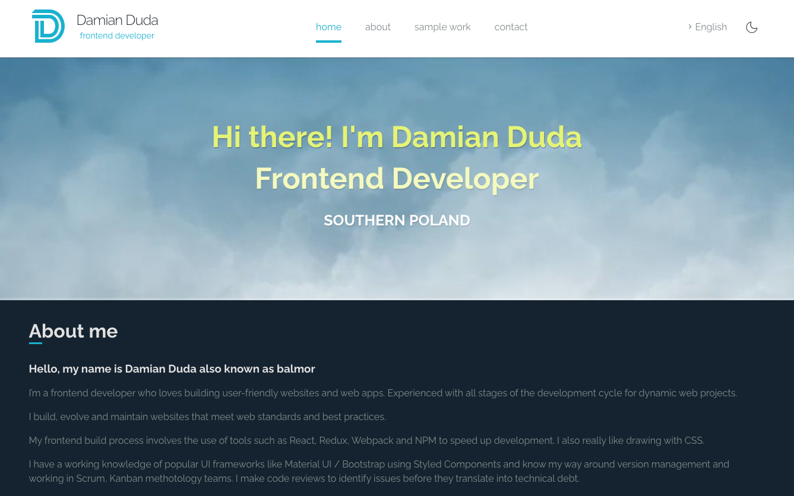

# Damian Duda - Frontend Developer

Damian Duda homepage using Gatsby, React, Typescript and Styled component.

## Getting Started

Install packages:

```
yarn install
```

Run local development:

```
yarn start
```

Build the app:

```
yarn build
```

## Link

[Damian Duda](https://balmor.github.io/exchange-rate/)

## Podgląd

[](/src/images/preview.png)

## TODO:

- [x] light / dark theme
- [x] add translation PL/EN
- [x] update components to dark/light mode
- [x] rewrite to reactjs / typescript / gatsby
- [x] use react-hook-form for contact form
- [x] add responsive mode for tablets and smartphones
